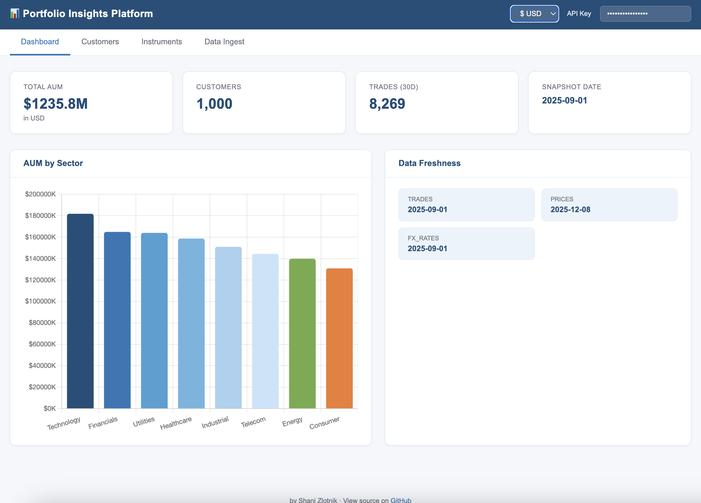

# Portfolio Insights Platform — POC

Internal data ingestion and analytics service. Ingests financial data from CSV/Excel files, stores it in PostgreSQL, and exposes a REST API + lightweight dashboard.

---



## Architecture

```
Whitelisted caller
     │  HTTP
     ▼
┌──────────────┐    enqueue     ┌─────────────────┐
│  API Service │ ─────────────► │  InMemoryQueue  │  (SQS in production)
│  (FastAPI)   │                └────────┬────────┘
└──────┬───────┘                         │ poll
       │ read/write               ┌──────▼──────┐
       │                          │   Worker    │
       └──────────┬───────────────┘  (async)    │
                  ▼                             │
           ┌────────────┐  ◄───────────────────┘
           │ PostgreSQL │
           └────────────┘
```

**Queue note:** The POC uses `InMemoryQueue` — a lightweight asyncio queue that runs inside the same process. Swapping to AWS SQS in production requires changing one line in `app/queue.py`.

---

## Prerequisites

- Docker + Docker Compose
- Python 3.11+ (for running tests locally without Docker)

---

## Running locally (Docker — recommended)

```bash
# 1. Clone / unzip the project
cd portfolio-insights

# 2. Start all services (API + PostgreSQL + frontend)
docker-compose up --build

# Services:
#   API:      http://localhost:8000
#   Docs:     http://localhost:8000/docs
#   Frontend: http://localhost:3000
```

The database schema is created automatically on first startup.

---

## Loading sample data

Sample files are in `sample_data/`. Load them in this order (reference data first, then fact data):

```bash
API=http://localhost:8000
KEY=dev-internal-key

# 1. Reference data
curl -X POST "$API/ingest/stocks"          -H "x-api-key: $KEY" -F "file=@sample_data/stocks_master.csv"
curl -X POST "$API/ingest/customers"       -H "x-api-key: $KEY" -F "file=@sample_data/customers.csv"
curl -X POST "$API/ingest/account-map"     -H "x-api-key: $KEY" -F "file=@sample_data/account_map.csv"
curl -X POST "$API/ingest/discount-rules"  -H "x-api-key: $KEY" -F "file=@sample_data/discount_rules.csv"

# 2. Fact data
curl -X POST "$API/ingest/fx-rates"   -H "x-api-key: $KEY" -F "file=@sample_data/fx_rates_usd.csv"
curl -X POST "$API/ingest/prices"     -H "x-api-key: $KEY" -F "file=@sample_data/price_history.csv"
curl -X POST "$API/ingest/holdings"   -H "x-api-key: $KEY" -F "file=@sample_data/holdings_snapshot.csv"
curl -X POST "$API/ingest/trades"     -H "x-api-key: $KEY" -F "file=@sample_data/trades_source_a.csv" -F "source=source_a"
```

Each call returns a `job_id`. Poll the status:

```bash
curl "$API/ingest/status/<job_id>" -H "x-api-key: $KEY"
```

---

## API reference

Full interactive docs at **http://localhost:8000/docs** (Swagger UI).

| Endpoint | Description |
|---|---|
| `POST /ingest/{type}` | Upload a CSV or Excel file for ingestion |
| `GET /ingest/status/{job_id}` | Poll ingestion job result |
| `GET /health` | Health check |
| `GET /summary` | Total AUM, customer count, data freshness |
| `GET /summary/by-sector` | AUM breakdown by sector |
| `GET /customers` | List customers |
| `GET /customers/{id}` | Customer detail |
| `GET /customers/{id}/holdings` | Holdings snapshot with USD values |
| `GET /customers/{id}/portfolio-value` | Daily portfolio value over a date range |
| `GET /customers/{id}/trades` | Trade history with filters |
| `GET /customers/{id}/discount` | Applicable fee discount |
| `GET /instruments` | Search instruments |
| `GET /instruments/{ticker}/prices` | Price history for a ticker |

**Auth:** All endpoints require the header `x-api-key: dev-internal-key` (configurable via `API_KEY` env var).

---

## Running tests

Tests use SQLite and do not require Docker or a running server.

```bash
# 1) Local (recommended)
python3 -m venv .venv
source .venv/bin/activate
python -m pip install -r requirements.txt
pytest -q --tb=short

# 2) Optional — run in a container (no local Python needed)
docker run --rm -v "$PWD":/workspace -w /workspace \
  python:3.11 bash -lc "pip install -q -r requirements.txt && pytest -q --tb=short"
```

Tests are split into:
- `tests/test_pipeline.py` — core pipeline unit tests (parse, date conversion, basic ingest)
- `tests/test_api.py` — core API integration tests (health, summary, customers, holdings, discount, instruments)

POC scope intentionally omits queue/ingestion flow and detailed trade behavior from tests.

---

## Project structure

```
portfolio-insights/
├── backend/
│   └── app/
│       ├── main.py          # FastAPI app, endpoints, startup, worker launch
│       ├── db.py            # Engine/session, ORM models, init_db
│       ├── pipeline.py      # Ingestion pipelines and handlers
│       └── worker.py        # Async worker loop
├── frontend/
│   └── index.html           # Single-file dashboard (vanilla JS + Chart.js)
├── tests/
│   ├── conftest.py          # SQLite test DB, TestClient wiring
│   ├── test_pipeline.py     # Pipeline unit tests (core)
│   └── test_api.py          # API integration tests (core queries)
├── sample_data/             # Sample CSV files
├── docker-compose.yml
├── Dockerfile
├── pytest.ini
└── requirements.txt
```

---

## Key design decisions

**InMemoryQueue instead of SQS** — the queue interface (`QueueBackend`) is defined as a Python Protocol. `InMemoryQueue` implements it using `asyncio.Queue`. In production, replacing it with an `SQSQueue` implementation requires changing one line. No other code changes needed.

**Async ingestion** — the API returns a `job_id` immediately (HTTP 202). The worker processes files in the background. Callers poll `GET /ingest/status/{job_id}` for the result. This prevents large files from holding HTTP connections open.

**Append-only fact tables** — trades, holdings, prices, and FX rates are never overwritten. Duplicate detection uses unique constraints. Reference tables (customers, stocks, rules) use full-replace transactions.

**CSV and Excel** — both formats are supported transparently. `pandas.read_csv` and `pandas.read_excel` both produce a DataFrame; the rest of the pipeline is identical.

